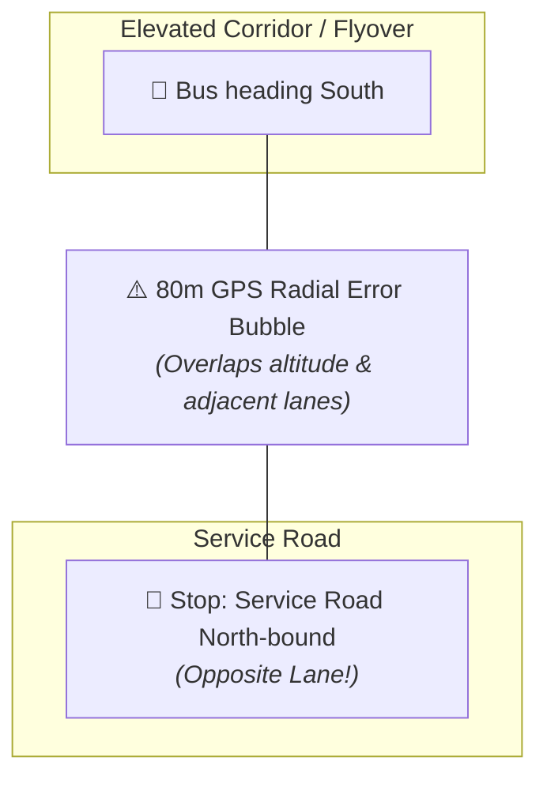
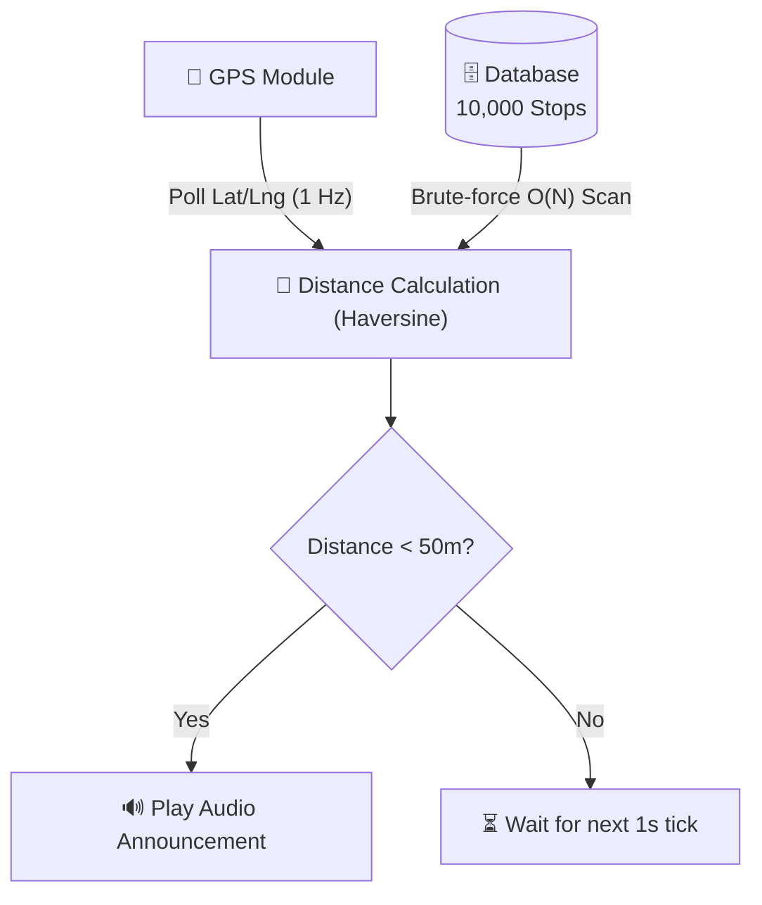
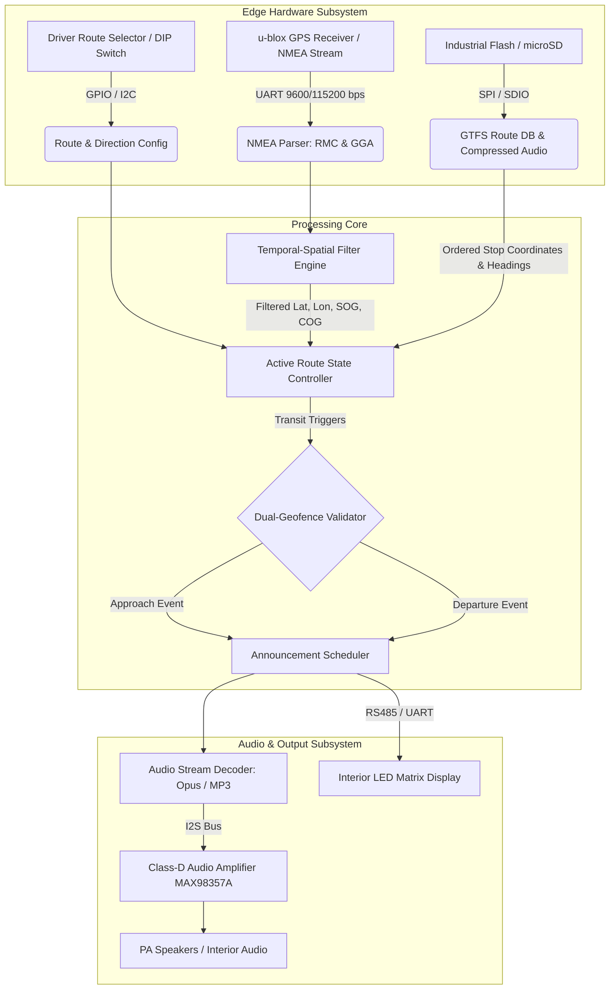
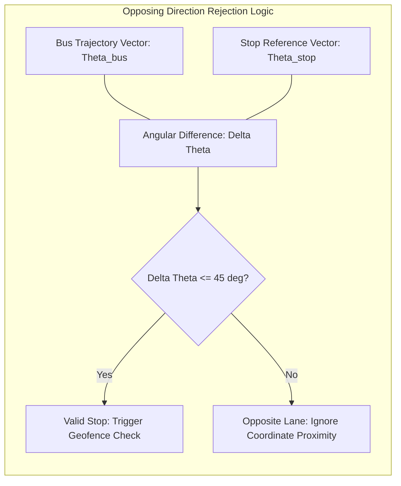
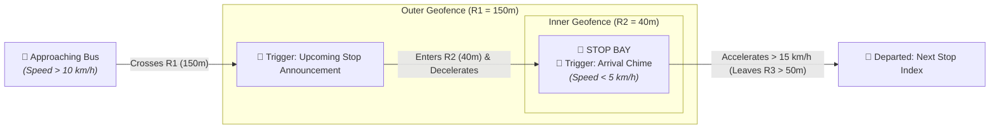
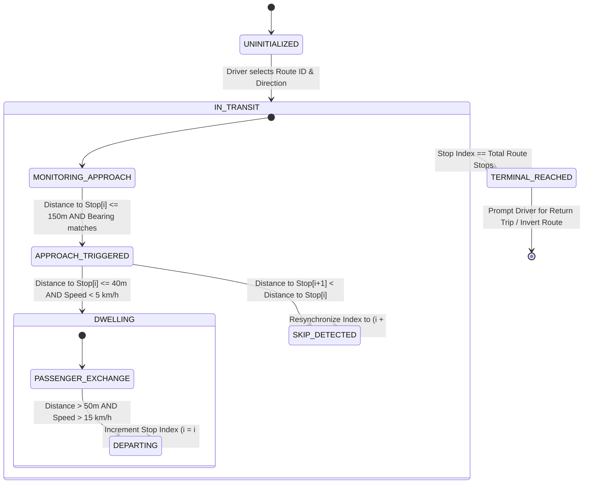

## 1. The Commute That Sparked the Query

If you've ever spent your evening commute on a BMTC Volvo navigating the crawl between Marathahalli and Silk Board on Bengaluru's Outer Ring Road (ORR), you know the sensory rhythm. The rumble of the diesel engine, the glare of brake lights reflecting off glass tech-park façades, and the periodic chiming of the Passenger Information System (PIS) telling you that you are approaching your stop.

Except when it doesn't.

Or worse, when the bus is idling under the Agara flyover, and the overhead speaker cheerfully announces that you've reached a bus stop on the service road 80 meters away—or announces the stop for the *opposing* lane headed toward Hebbal.




As software engineers, our immediate instinct when observing these glitches in the wild is to deconstruct the system: *What sensor suite is driving this? How does it handle spatial indexing across 10,000 transit stops? Why did it fire a false positive? And how would we architect an offline, resilient, sub-₹2,500 hardware solution that never gets confused?*

Let's walk through the end-to-end technical architecture of an offline, GPS-guided Bus Stop Announcement System designed to handle dense, noisy urban geography.

---

## 2. The Naïve Architecture (And Why It Fails)

The intuitive first approach that many engineers pitch looks like this:




While conceptually simple, this naïve spatial lookup breaks down in the real world due to four distinct physical and algorithmic issues:

### A. The $O(N)$ Overhead Problem

Polling 10,000 latitude/longitude pairs every second on a low-cost microcontroller (like an ESP32 or an ARM Cortex-M4) means executing 10,000 transcendental trigonometric functions (sine, cosine, arctan) per second. Even with spatial partitioning trees ($k\text{-d}$ trees or spatial hash grids), spatial search across an unconstrained planar surface is the wrong paradigm for public transit.

### B. Opposing-Lane Ambiguity

In a dense city, arterial roads often feature two bus stops with identical or similar names sitting directly across the street from one another—separated by a 15-meter median. A simple radial threshold will trigger both stops indiscriminately, or fire the wrong directional stop depending on GPS satellite drift.

### C. The Flyover / Service Road Dilemma

GPS operates via trilateration of RF signals from satellites. Horizontal accuracy ($X, Y$) in consumer-grade modules (e.g., u-blox NEO-8M) hovers around $\pm 2.5\text{ m}$ under clear skies, but vertical accuracy ($Z$) degrades to $\pm 10\text{ m to } 20\text{ m}$. In places with double-decker flyovers or elevated transit corridors, a 2D radius search cannot distinguish whether a bus is cruising on the elevated expressway or pulling into a bay on the service road beneath it.

### D. Urban Canyons and Multipath Jitter

Glass façades, concrete flyovers, and steel bridge trusses cause RF signals to bounce before reaching the bus antenna. This **multipath interference** induces artificial velocity and instantaneous coordinate jumps. If a bus is halted at a red light 40 meters from a stop, jitter will cause the calculated position to hop in and out of the triggering radius, spamming passengers with repeated announcements.

---

## 3. High-Level Functional Architecture

To eliminate these failure modes, we must move away from *unconstrained spatial search* to a **deterministic, route-constrained topological state machine**. A bus does not roam freely across a 2D plane; it traverses a 1D ordered sequence of topological waypoints.

Here is the functional system layout:



---

## 4. Algorithmic Deep Dive

### 4.1. Fast Local Distance: Equirectangular Projection

The standard **Haversine formula** calculates great-circle distances over a sphere:

$$d = 2R \arcsin \left( \sqrt{\sin^2\left(\frac{\Delta \phi}{2}\right) + \cos(\phi_1)\cos(\phi_2)\sin^2\left(\frac{\Delta \lambda}{2}\right)} \right)$$

While exact, Haversine requires computing four trigonometric functions and two square roots. At an embedded edge node, this is computationally expensive. Because bus announcements operate over distances under $1\text{ km}$, we can map the spherical coordinates to a local Cartesian plane using the **Flat-Earth / Equirectangular approximation**:

$$x = \Delta \lambda \cdot \cos\left(\frac{\phi_1 + \phi_2}{2}\right)$$

$$y = \Delta \phi$$

$$d = R \cdot \sqrt{x^2 + y^2}$$

*Where $\phi$ is latitude in radians, $\lambda$ is longitude in radians, and $R = 6,371,000\text{ meters}$.*

This approximation reduces the computation to **a single cosine, two additions, three multiplications, and one square root**, executing in under $0.5\ \mu\text{s}$ on an FPU-equipped microcontroller, with an error margin of less than $0.1\%$ over distances under $5\text{ km}$.

---

### 4.2. Heading Vector Alignment (Filtering Out Opposing Lanes)

To prevent triggering stops on the wrong side of the road, the algorithm calculates the **Course Over Ground (COG)** from the GPS receiver and compares it against the **nominal road bearing** ($\theta_{\text{stop}}$) stored in the database for that specific transit stop.



The angular difference $\Delta \theta$ is computed modulo $360^\circ$:

$$\Delta \theta = \vert{}(\theta_{\text{bus}} - \theta_{\text{stop}} + 180^\circ) \pmod{360^\circ} - 180^\circ\vert{}$$

* **Rule:** If $\Delta \theta > 45^\circ$, the bus is facing the wrong direction. The system suppresses all proximity triggers for that stop, regardless of physical proximity.
* **Low-Speed Guard:** When speed drops below $3\text{ km/h}$, GPS heading readings experience severe noise. The system locks the last reliable bearing until velocity recovers.

---

### 4.3. Dual Concentric Geofencing with Hysteresis

Instead of a single radius that fires an announcement once breached, we implement a **Dual-Zone Concentric Geofence** to manage both "Upcoming" and "Current" announcements:



1. **Outer Boundary ($R_1 = 150\text{ m}$):** Bus crosses $R_1$ while traveling at transit speeds ($>10\text{ km/h}$).
* **Action:** Audio playback triggered: *"Next stop: Kadubeesanahalli / ಮುಂದಿನ ನಿಲ್ದಾಣ: ಕಾಡುಬೀಸನಹಳ್ಳಿ"*.


2. **Inner Boundary ($R_2 = 40\text{ m}$):** Bus enters $R_2$ and decelerates ($<5\text{ km/h}$).
* **Action:** Audio chime triggered: *"Arriving at Kadubeesanahalli / ಕಾಡುಬೀಸನಹಳ್ಳಿ ತಲುಪುತ್ತಿದ್ದೇವೆ"*.


3. **Departure Threshold ($R_3 > 50\text{ m}$):** Bus leaves the stop bay, accelerating past $15\text{ km/h}$.
* **Action:** Stop index incremented ($i \leftarrow i + 1$). The state machine advances to listen for the next stop in sequence.


---

## 5. The Route State Machine (Deterministic Transit Model)

By loading an ordered array of stops for the active route, query complexity drops from $O(N)$ across all 10,000 stops to **strictly $O(1)$**. The algorithm only ever checks the distance to **Stop $i$** (current) and **Stop $i+1$** (lookahead).



### Handling Edge Cases: The "Skipped Stop" Algorithm

What happens if the bus driver skips a stop by taking an elevated express flyover or an alternate lane?

* If the state machine only checks Stop $i$, it will stall indefinitely.
* **Resolution Window:** The controller runs a continuous secondary check against a small lookahead window: $\text{Stop}_{i+1}$ and $\text{Stop}_{i+2}$. If the bus enters the inner perimeter of $\text{Stop}_{i+1}$ or its distance to $\text{Stop}_{i+2}$ shrinks below the distance to $\text{Stop}_{i}$, the state machine triggers an **autonomous skip recovery**, advances the pointer, and suppresses redundant approach audio.

---

## 6. Python Implementation: The Route-Aware State Engine

Here is a production-grade implementation of the core decision logic:

```python
import math
from dataclasses import dataclass
from enum import Enum
from typing import List, Optional

class TransitState(Enum):
    IN_TRANSIT = 1
    APPROACHING = 2
    DWELLING = 3
    DEPARTED = 4
    TERMINATED = 5

@dataclass(frozen=True)
class BusStop:
    stop_id: str
    name_en: str
    name_kn: str
    lat: float
    lon: float
    bearing_deg: float  # Expected road heading at arrival

@dataclass
class GPSFix:
    lat: float
    lon: float
    speed_kmh: float
    course_deg: float
    valid: bool

class RouteEngine:
    EARTH_RADIUS_METERS = 6371000.0

    def __init__(self, route_id: str, stops: List[BusStop]):
        self.route_id = route_id
        self.stops = stops
        self.current_idx = 0
        self.state = TransitState.IN_TRANSIT
        self.approach_radius = 150.0  # Outer boundary (meters)
        self.dwelling_radius = 40.0   # Inner arrival boundary (meters)
        self.departure_radius = 60.0  # Hysteresis reset boundary (meters)
        self.bearing_tolerance = 45.0 # Degrees

    @staticmethod
    def flat_distance(lat1: float, lon1: float, lat2: float, lon2: float) -> float:
        """Equirectangular high-speed distance approximation."""
        phi1 = math.radians(lat1)
        phi2 = math.radians(lat2)
        delta_phi = math.radians(lat2 - lat1)
        delta_lam = math.radians(lon2 - lon1)
        mean_phi = (phi1 + phi2) / 2.0

        x = delta_lam * math.cos(mean_phi)
        y = delta_phi
        return RouteEngine.EARTH_RADIUS_METERS * math.sqrt(x * x + y * y)

    @staticmethod
    def bearing_delta(b1: float, b2: float) -> float:
        """Computes smallest angular difference between two headings."""
        return abs((b1 - b2 + 180.0) % 360.0 - 180.0)

    def process_gps_tick(self, fix: GPSFix) -> Optional[str]:
        if not fix.valid or self.state == TransitState.TERMINATED:
            return None

        target = self.stops[self.current_idx]
        dist_to_target = self.flat_distance(fix.lat, fix.lon, target.lat, target.lon)

        # Check for skipped stop (lookahead = 1)
        if self.current_idx + 1 < len(self.stops):
            next_target = self.stops[self.current_idx + 1]
            dist_to_next = self.flat_distance(fix.lat, fix.lon, next_target.lat, next_target.lon)
            if dist_to_next < self.dwelling_radius:
                self.current_idx += 1
                self.state = TransitState.DWELLING
                return f"SKIP_RECOVERED: Arrived at {next_target.name_en}"

        # Evaluate state machine transitions
        if self.state == TransitState.IN_TRANSIT:
            b_diff = self.bearing_delta(fix.course_deg, target.bearing_deg)
            # Only trigger approach if within range AND heading matches road orientation
            if dist_to_target <= self.approach_radius and (fix.speed_kmh < 5.0 or b_diff <= self.bearing_tolerance):
                self.state = TransitState.APPROACHING
                return f"ANNOUNCE_NEXT: Next Stop is {target.name_en} ({target.name_kn})"

        elif self.state == TransitState.APPROACHING:
            if dist_to_target <= self.dwelling_radius and fix.speed_kmh < 15.0:
                self.state = TransitState.DWELLING
                return f"ANNOUNCE_CURRENT: Arrived at {target.name_en}"

        elif self.state == TransitState.DWELLING:
            # Departure condition: Moved away from stop and accelerating
            if dist_to_target > self.departure_radius and fix.speed_kmh > 10.0:
                self.state = TransitState.DEPARTED
                return f"DEPARTED: Left {target.name_en}"

        elif self.state == TransitState.DEPARTED:
            # Advance pointer and loop back to transit monitoring
            if self.current_idx + 1 < len(self.stops):
                self.current_idx += 1
                self.state = TransitState.IN_TRANSIT
                next_stop = self.stops[self.current_idx]
                return f"STATUS: Tracking upcoming stop -> {next_stop.name_en}"
            else:
                self.state = TransitState.TERMINATED
                return "STATUS: End of route reached."

        return None

```

---

## 7. Embedded Hardware & Storage Budget

Can this entire system run on affordable, readily available embedded components without requiring cellular connectivity?

### Bill of Materials (BOM) for Edge Deployment

| Subsystem | Component | Role | Estimated Cost |
| --- | --- | --- | --- |
| **MCU / SoC** | ESP32-S3 (WROOM-1) | Dual-core 240MHz, 8MB PSRAM, 16MB Flash | ~₹350 |
| **GPS / GNSS** | u-blox NEO-M8N / ATGM336H | NMEA parsing at 5Hz, high sensitivity antenna | ~₹550 |
| **Audio DAC** | MAX98357A I2S 3W Class D | Clean direct-to-speaker digital decoding | ~₹100 |
| **Storage** | Industrial MicroSD (16GB) | Offline audio assets and complete GTFS schedules | ~₹300 |
| **Power Reg.** | Automotive DC-DC Step-Down | 24V bus power to 5V 2.5A with surge protection | ~₹240 |
| **User Interface** | 2-Digit 7-Segment + Rotary Dial | Driver route selection (e.g., dial "5-0-0-D") | ~₹130 |
| **Total Hardware Cost** |  |  | **~₹1,670** |

### Storage Math for 10,000 Stops

Let's confirm whether 10,000 stops fit into a micro-footprint:

* **Coordinates & Metadata:**
* Record: `Stop_ID (4B) + Lat (4B float) + Lon (4B float) + Bearing (2B) + Audio_Offset (4B) = 18 Bytes`.
* Total database size: $10,000 \times 18\text{ B} = \mathbf{180\text{ KB}}$ (Fits completely into SRAM!).


* **Bilingual Audio Clips:**
* Kannada + English announcement: Average 3.5 seconds per stop.
* Encoded using modern **Opus** speech compression at $16\text{ kbps}$ (clear speech intelligibility):
$$\text{Bitrate} = 2\text{ KB/s} \implies 3.5\text{ s} \times 2\text{ KB/s} = 7\text{ KB per stop}$$


* Total audio capacity for 10,000 stops:
$$10,000 \times 7\text{ KB} \approx \mathbf{70\text{ MB}}$$


A standard 16GB industrial MicroSD card has over **200 times** the capacity required. The entire transit map of a major metropolis can live on a microchip without ever connecting to a cloud backend.

---

## 8. Summary: What We Learned from the Road

1. **Problem Space Reduction**: Convert a 2D spatial search across 10,000 points into an ordered 1D state array. Query complexity drops from $O(N)$ to $O(1)$.
2. **Dual-Zone Geofencing**: Use an outer perimeter (150m) for approach alerts and an inner perimeter (40m) for dwell detection.
3. **Vector Alignment**: Compare bus course-over-ground against the stop's roadway bearing to eliminate opposing-lane false triggers.
4. **Hysteresis & Guardrails**: Require low velocity (<15 km/h) for arrival confirmation to filter out non-stopping flyover traffic.
5. **Full Offline Autonomy**: Modern audio compression (Opus) enables 10,000 bilingual stops to fit within 70 MB of storage on a sub-₹1,700 hardware setup.


The next time you're sitting in traffic on an urban bus route, listening to a crisp, perfectly timed stop announcement, you're not just looking at a GPS receiver—you're looking at a carefully tuned interplay of spatial indexing, vector geometry, and edge computing running reliably on modest embedded hardware.