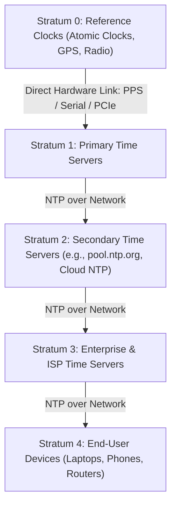

In the world of distributed systems, time is rarely synchronized by default. Whether you are a software engineer debugging logs or a hardware enthusiast, understanding how computers agree on "now" requires looking past the clock face and into the mechanics of **Round-Trip Delay (RTD)**.

## The Heart of the Matter: Round-Trip Delay

The biggest enemy of time synchronization is latency. If a server sends you a message saying "It is exactly 12:00:00," by the time that message travels through routers and cables to reach your machine, it might already be 12:00:00.050.

To solve this, the **Network Time Protocol (NTP)** uses a four-timestamp exchange to calculate the total "flight time" of a packet:

1. **T1:** Client sends request.
2. **T2:** Server receives request.
3. **T3:** Server sends response.
4. **T4:** Client receives response.

The Round-Trip Delay (δ) is calculated by subtracting the server's internal processing time from the total elapsed time:

```
δ = (T4 - T1) - (T3 - T2)
```

By assuming the network path is symmetric, the client simply divides $\delta$ by two to determine exactly how much latency to subtract from the server's timestamp.

## The NTP Hierarchy: Understanding Strata

Even if two machines can calculate Round-Trip Delay accurately, a fundamental question remains: **who decides what time it actually is?**

If every computer on the internet queried national atomic clocks directly, those servers would instantly collapse under the load. To distribute traffic and guarantee resilience, NTP organizes time sources into a hierarchical, tiered architecture known as **Strata** (singular: *Stratum*).

A stratum level represents the degree of separation (in network hops and synchronization layers) from the authoritative reference clock:



### Stratum 0: The Reference Clocks
These are the ground-truth sources of time. Stratum 0 devices are high-precision physical hardware:
- **Atomic clocks** (Cesium beam standards and Rubidium oscillators)
- **GNSS / GPS satellites**
- **Radio time broadcasts** (e.g., WWVB in the US, DCF77 in Germany)

Crucially, **Stratum 0 devices are never connected directly to the internet.** Because they lack network interfaces and packet-processing stacks, they connect to a dedicated host computer via hardware interfaces like serial ports, PPS (Pulse Per Second) signals, or PCIe timing cards.

### Stratum 1: Primary Time Servers
A server physically wired to a Stratum 0 device is a **Stratum 1** server (also called a primary time server). These act as the gateway between raw physical clock signals and the packet-switched world. Their job is to serve authoritative timestamps with sub-millisecond precision to downstream systems across the network.

### Stratum 2: The Workhorses of the Internet
**Stratum 2** servers synchronize with one or more Stratum 1 servers across a network. These represent the bulk of publicly available NTP servers, such as those in the [NTP Pool Project](https://www.ntppool.org/) and cloud provider infrastructure (e.g., AWS Time Sync Service or Google Public NTP).

Stratum 2 servers do not blindly mirror a single upstream clock. Instead, they query multiple Stratum 1 peers, running statistical algorithms (such as Marzullo's algorithm) to filter out network jitter and discard "falsetickers" (servers reporting inaccurate time).

### Stratum 3 to 15: Cascading to the Edge
Each subsequent hop increments the stratum number:
- **Stratum 3** servers sync from Stratum 2 servers (often acting as central time hubs for corporate intranets or ISPs).
- **Stratum 4** is typically where consumer laptops, smartphones, and IoT devices operate when syncing against local routers or corporate servers.

NTP supports up to **Stratum 15**.

### Stratum 16: The Out-of-Sync Indicator
**Stratum 16** is a special designator. It does not represent an actual layer in the hierarchy; rather, it indicates that a device is **completely unsynchronized**—its clock has drifted, or all upstream time sources are currently unreachable. Any server reporting Stratum 16 is rejected by downstream clients.

### Why Strata Matter: Scale and Loop Prevention
The stratum model accomplishes two vital goals in distributed networks:
1. **Load Distribution:** Billions of internet-connected devices can stay synchronized without overwhelming the world's primary time standards.
2. **Loop Prevention:** NTP packets carry the stratum number and the reference identifier of their upstream source. If server A syncs from server B, server B will never accept time from server A, preventing destructive feedback loops.

## Accuracy: Milliseconds vs. Microseconds
While the math behind Round-Trip Delay is elegant, its real-world accuracy depends entirely on the stability of your network:

- **NTP (The Standard):** Used by macOS, Windows, and Linux for general system clocks. Because it operates in software and over the standard internet, it usually achieves 1–50 millisecond accuracy. It is perfect for logs and general scheduling but struggles with "jitter" (fluctuations in latency).
- **PTP (The Specialist):** The Precision Time Protocol (IEEE 1588) is the high-performance sibling of NTP. It can achieve sub-microsecond accuracy.

## PTP: Precision Beyond Milliseconds

For most of us, being off by 10 milliseconds doesn't matter. But for a power grid, a cellular tower, or a high-frequency trading floor, a millisecond is an eternity. This is where PTP (Precision Time Protocol) enters the picture.

While NTP is software-based, PTP is hardware-driven. It aims for sub-microsecond accuracy—often getting within nanoseconds of atomic clocks.

### Why Can't My Phone or PC Use PTP?

If PTP is so much better, why don't our Macs, Windows PCs, or iPhones use it? There are three main "gatekeepers" preventing PTP from becoming a consumer standard:

### 1. The Hardware Barrier

PTP requires Hardware Timestamping. In a standard PC or phone, the network chip passes a packet to the CPU, and the Operating System (OS) eventually "stamps" the time. This delay is unpredictable. PTP requires a specialized Network Interface Card (NIC) that stamps the packet the exact nanosecond it touches the physical wire.

### 2. The "Intelligent" Network Requirement

Standard home routers and switches are "dumb" regarding time. They might hold a packet for a millisecond if they are busy, which ruins PTP’s accuracy. For PTP to work, every single switch between the server and your device must be "PTP-aware" (called Transparent or Boundary Clocks) to account for their own internal processing delay.

### 3. The Complexity of the OS

Consumer operating systems like macOS and Windows are designed for user experience, not "hard real-time" performance. They perform thousands of background tasks that cause "jitter." Even if the network card knew the perfect time, the OS might be too busy to update the system clock immediately, rendering the microsecond precision useless.

Accuracy in timekeeping is a battle against the unknown variables of a network path. By using Round-Trip Delay to "math away" the speed of light and network congestion, our devices can stay in sync—whether we need the millisecond precision of a web server or the microsecond perfection of a recording studio.